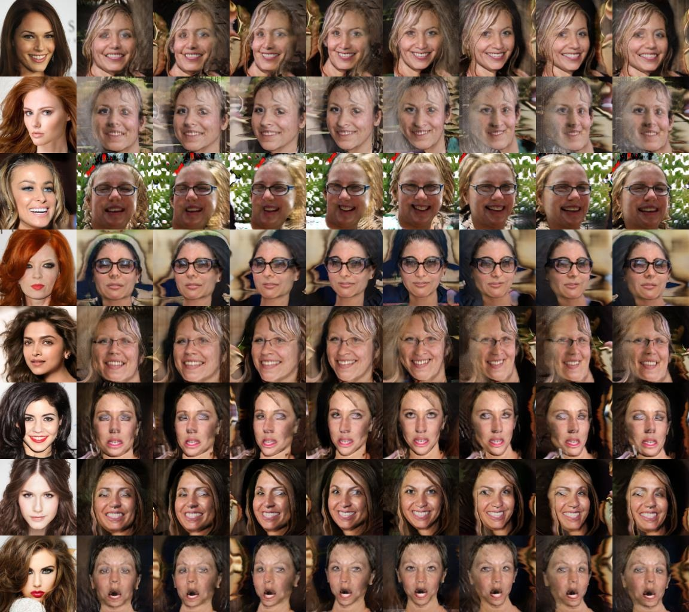

# Modiefied Stargan-v2 for 3D-aware GAN

## 개요
본 REPO는 개인 프로젝트를 위한 repo로, **EG3D** 논문과 **Stargan-v2** 논문을 참고하여 생성되었습니다.</br>
본 REPO의 목적은 **Stargan-v2**에 ```tri-plain representation```을 적용하여 geometry aware한 모델을 목표로 하였으며, 이유는 아래와 같습니다.</br>

1. 3D-aware GAN에 대한 지식을 바탕으로 EG3D에서 제안한 Data Representation을 다른 방법론에 적용해보고 싶어 진행하였습니다.
2. 기존 방법은 e4e([Encoder for Editing](https://github.com/omertov/encoder4editing)), pSp([pixel2Style2pixel](https://github.com/eladrich/pixel2style2pixel)), PTI([Pivot Tuning Inversion](https://github.com/danielroich/PTI.git)) 등의 방법과 같이 이미지에서 Encoder를 통해 추출한 latent vector를 별도의 데이터로 저장하여 GAN의 입력으로 하여금 이미지를 생성하지만, 본 REPO에서는 이미지를 입력으로 하여 Target 이미지에 대한 style vector를 참고한 이미지를 생성하는 방법을 시도해보고 싶어 진행하였습니다.

수정한 Stargan-v2의 framework를 밑에 보이시는 그림과 같이 수정했습니다.</br></br>
<p align="center"></p>

위의 모델은 **Target image**와 **Real image**를 입력으로 **Target image**로부터 추출된 style vector를 **Real image**에 적용시켜 Generator에서 추출된 결과를 ```Tri-plane representation```으로 변형하여 Volume Rendering을 수행합니다.</br></br>
생성된 이미지는 Discriminator에서 기존 **Stargan-v2**의 pipeline을 따라 판별됩니다.
다만, 기존의 Discriminator와 다르게 camera parameter를 추가로 입력 받아 **pose aware**하도록 Discriminator를 학습시킵니다.


## 학습결과
학습환경은 아래와 같이 구성했습니다.</br>
```
OS : LINUX 20.04
CPU : Intel(R) Xeon(R) Silver 4214R CPU @ 2.40GHz
GPU : NVIDIA RTX A6000(VRAM 48G)
RAM : 128G
```

아래의 사진은 모델을 ```3.7M``` 학습한 결과입니다.</br>
여기서 카메라 파라미터는 **Target image**의 데이터가 아니라 임의로 설정하여 이미지 생성에 사용하였습니다.</br>
```PYTHON
c2w = LookAtPoseSampler.sample(np.pi/2 + yaw_range * np.sin(2 * np.pi * idx / batch_size),
                               np.pi/2 -0.05 + pitch_range * np.cos(2 * np.pi * idx / batch_size),
                               torch.tensor([0, 0, 0.2]), radius=2.7, device=device)
```

학습의 결과를 보면, 기존의 **Stargan-v2** 모델과 다르게 학습이 제대로 이루어지지 않았고, ```Style Transfer``` 또한 제대로 수행되지 않았습니다.</br>
Depth 이미지에서도 얼굴 외 다른 부분에 수많은 ```Artifacts``` 들이 있는 것을 볼 수 있습니다.</br>
그 이유는 pre-trained 모델 없이 처음부터 학습하는 과정에서 충분한 학습이 이루어지지 않았기 때문으로 보여집니다.</br>
반대로, 임의로 설정한 카메라 파라미터를 통해 이미지를 생성하였을 때, 각도 변화가 이루어지고 있으며,</br>
Depth 이미지를 보았을 때, 이미지에서 생성된 안경부분이 선명하게 생성된 점을 본다면, 충분한 학습이 이루어졌을 때 개선된 성능을 보일 것 같습니다.

<p align="center">


</p>

---
### 참고
Stargan-v2(StarGAN v2: Diverse Image Synthesis for Multiple Domains)  - [github](https://github.com/clovaai/stargan-v2) </br>
EG3D(Efficient Geometry-aware 3D Generative Adversarial Networks) - [github](https://github.com/NVlabs/eg3d)

본 Repository는 연구용 목적으로 개설되었습니다.
